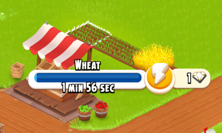
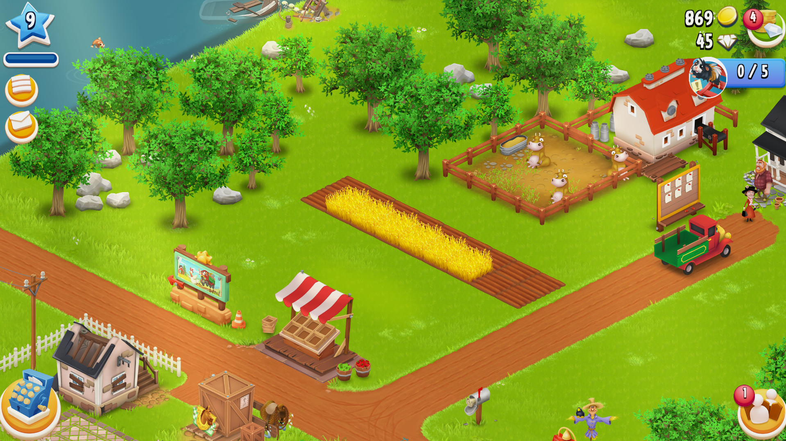

# DISCLAIMER
This project is created solely for educational and hobby purposes. It is not affiliated with, endorsed, or supported by Supercell, the developers of Hay Day.By using this bot, you assume full responsibility for any consequences, including potential account restrictions or bans. The creator of this bot is not responsible for how it is used or any issues arising from its use.Use this software at your own risk, and always respect the terms of service of the game. This is just a hobby project and is not actively maintained. If you have any issues I cannot help you, I just wanted to share this bot with the public. I only tested this bot with a windows machine, i cannot guarantee that this bot runs with linux or mac.

# HAY DAY WHEAT BOT
## DESCRIPTION
This bot automates the wheat farming process in the Hay Day mobile game. In the game, players receive land, silo, and barn expansion materials as bonuses when harvesting crops. Since wheat has the shortest harvest time (2 minute), it is the most efficient crop for acquiring these rewards. Most bots automate this process using wheat as the primary crop.

## Setup
### 1. Install Python
Install python in your system. I used Python 3.13.2 for this project. If it's not works for latest versions use version 3.13.2 version of Python.
Run the following commands in order step by step.

### 2. Create Virtual Environment
```sh
python -m venv venv
```
### 3. Activate Virtual Environment
Run the appropriate command based on your os and terminal.
#### Windows (Command Prompt):
```sh
venv\Scripts\activate.bat
```

#### Windows (PowerShell):
```sh
venv\Scripts\Activate.ps1
```

#### macOS/Linux:
```sh
source venv/bin/activate
```
After activation, your terminal prompt should start with `(venv)`.

### 4. Install Dependencies

Once the virtual environment is activated, install the required dependencies:

```sh
pip install -r requirements.txt
```
## Emulator
- Open Hay Day game in a emulator(i used **BlueStacks**) in fullscreen mode (without borders absolute fullscreen).
- For the more than one screen, I didn't tested. Best use case is one monitor.
- I strictly not recommending to use this bot on your main farm. Create a new farm for this bot.
- For the bot to function properly, the game's language must be set to English.
- Your game screen should be zoomed out as much as possible.

## Before Start The Bot
### Design Your Farm
#### 1. Distance Of Field To Marketplace
The fields should be positioned neither too close nor too far from the market. The field's UI may overlap with the roadside, which can obstruct vision detection and prevent the shop from being visible.
Bad Example


#### 2. Fields Should Be Visible
There should be no objects in front of the fields, ensuring they remain clearly visible on the screen.
Bad Examples


#### 3. Field Rotation
The lines on the fields should be aligned parallel from the top-left corner to the bottom-right corner, as shown in the image
Good Example


#### Good Example Design Setup
Before starting the bot, make sure your farm layout matches the example shown. The roadside market shouldn’t be too close or too far away. There should be nothing blocking its view, so it’s clearly visible. The fields should be arranged diagonally from the top-left corner to the bottom-right corner.


## Starting Bot
Before starting bot your emulator on fullscreen and game zoomed out as much as possible.
Best way to start bot is all fields are filled with grown wheat and there is no wheat in your silo.
Run the command below.
```sh
python main.py
```
In the bot menu enter 'w'. Then you have 10 seconds to back to game. 
Press 'q' to exit the app. If 'q' doesn't work, use 'Ctrl + C' instead.